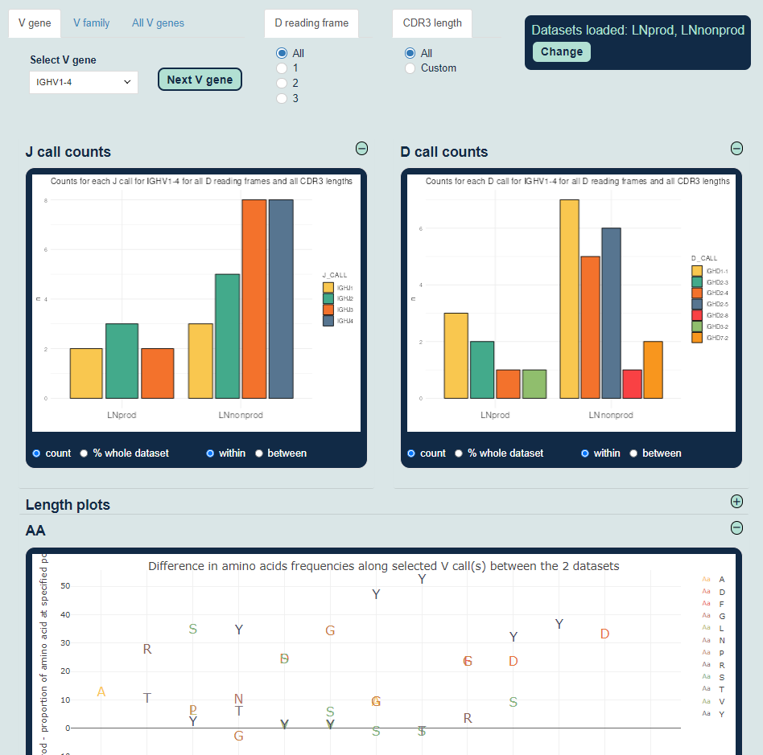

# VCALL explore

Shiny application to explore VDJ data. From the 25 preloaded datasets, 2 can be selected and compared.   
Individual V genes, families, or all V genes can be selected to compare J calls, D calls, lengths, and frequency of amino acis at each position.

